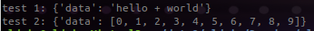

# pyWSdemo

Demo to create simple website, calling python functions and divide tasks.

# Backend

## Python Dependencies

``` sh
pip install gunicorn
pip install pycnic
```

## api.py

Class with all your needed python functions:

``` python
""" pyWSdemo - api """
#make python2 and python3 compatible
from __future__ import print_function
from __future__ import absolute_import
from __future__ import division

class Api:
    """ api functions """

    def myFuncOne(self, one, two):
        #always define a dictionary to return
        data = { 'data': None }
        data['data'] = str(one)+' + '+str(two)
        return data

    def myFuncTwo(self):
        data = { 'data': None }
        data['data'] = [ i for i in range(10) ]
        return data
```

#### test_api.py

Just for testing purposes, when working on your python functions. No need to refresh your frontend constantly then.

``` python
""" pyWSdemo - test_api """
#make python2 and python3 compatible
from __future__ import print_function
from __future__ import absolute_import
from __future__ import division
####
from api import Api

api = Api()

print( 'test 1: '+ str(api.myFuncOne('hello', 'world')) )                       #dict returned
print( 'test 2: '+ str(api.myFuncTwo()) )                                       #dict returned
```



## ws.py ([pycnic](https://github.com/nullism/pycnic))

Use pycnic to route the receiving webservice requests:

* import the ws handler,
* import your api
* create routes
    * GET http://{url}:{port}/
    * GET http://{url}:{port}/funcOne/{paramOne}/{paramTwo}
    * POST http://{url}:{port}/funcOne      {"paramOne": "hello", "paramTwo": "world"}
    * GET http://{url}:{port}/funcTwo
* avoid Cross-Origin Request Blocked by setting Access-Control-Allow-Origin header

``` python
""" pyWSdemo - ws """
from __future__ import print_function
from __future__ import absolute_import
from __future__ import division
####
from pycnic.core import WSGI, Handler
####
from api import Api

api = Api()

class RootRoute(Handler):
    """ / """
    def get(self):
        """ GET / """
        return { 'empty': ' as my mind' }

class funcOneRoute(Handler):
    """ /funcOne/ """
    def get(self, params):
        """ GET /funcOne/{one}/{two} """
        paramLst = params.split('/')
        if len(paramLst)==2:
            return api.myFuncOne( paramLst[0], paramLst[1] )
        else:
            return { 'error': 'wrong amount of parameters' }

    def post(self):
        """ POST /functOne   parameters: paramOne, paramTwo """
        paramOne = self.request.data['paramOne']
        paramTwo = self.request.data['paramTwo']
        return api.myFuncOne( paramOne, paramTwo )

class funcTwoRoute(Handler):
    """ /funcTwo """
    def get(self):
        return api.myFuncTwo()      #example without parameters needed

class App(WSGI):
    """ pycnic app - routes """
    headers = [("Access-Control-Allow-Origin", "*")]
    routes = [('/', RootRoute()),
            ('/funcOne/(.*)', funcOneRoute()),                                  #funcOne GET
            ('/funcOne', funcOneRoute()),                                       #funcOne POST
            ('/funcTwo', funcTwoRoute()),                                       #funcTwo GET
            ]
```

## run.sh : webserver ([gunicorn](https://github.com/benoitc/gunicorn))

Using Gunicorn as a Python WSGI HTTP Server:

* --reload : automatic reload after changing python code (very useful)
* -w : amount of workers
* --access-logformat --access-logfile --error-logfile : logfile settings
* --capture-output : redirect stdout/stderr to errorlog (print to debug)
* ws:App : load class *App*(WSGI) in *ws*.py

``` sh
#!/bin/bash
gunicorn --reload -b 0.0.0.0:8100 -w 4 \
         --access-logformat '%(h)s %(l)s %(u)s %(t)s "%(r)s" %(s)s %(b)s %(D)s "%(f)s" "%(a)s"' \
         --access-logfile access_gunicorn.log --error-logfile error_gunicorn.log --log-level normal \
         --capture-output \
         ws:App
```

#### test_ws.sh

Just for testing the ws functions via shell:

``` sh
#!/bin/bash

echo "GET root"
curl -i -X GET -H 'Content-Type: application/json' http://localhost:8100/
echo "GET funcOne:"
curl -i -X GET -H 'Content-Type: application/json' http://localhost:8100/funcOne/hello/world
echo "POST funcOne:"
curl -i -X POST -H 'Content-Type: application/json' -d '{"paramOne": "hello", "paramTwo": "world"}' http://localhost:8100/funcOne
echo "GET funcTwo"
curl -i -X GET -H 'Content-Type: application/json' http://localhost:8100/funcTwo/
```

# Frontend

## pyWSdemo.js

Using XMLHttpRequest to call webservices from Javascript:

``` javascript
var httpobject;

function getRadioVal(name) {
    var radios = document.getElementsByName(name);
    for (var i=0, len=radios.length; i<len; i++) {
        if ( radios[i].checked ) { return radios[i].value; }
    }
}

function getResult() {
    val = getRadioVal("howto");
    httpobject=GetHttpObject();
    httpobject.onreadystatechange=stateChanged;
    if (val=='root') {
        url = 'http://localhost:8100/'
        httpobject.open("GET",url,true); httpobject.send(null);
    }
    if (val=='getOne') {
        paramOne = document.getElementById('paramOne').value;
        paramTwo = document.getElementById('paramTwo').value;
        url = 'http://localhost:8100/funcOne/'+paramOne+'/'+paramTwo+'/';
        httpobject.open("GET",url,true); httpobject.send(null);
    }
    if (val=='postOne') {
        var params = {};
        params.paramOne = document.getElementById('paramOne').value;
        params.paramTwo = document.getElementById('paramTwo').value;
        var json = JSON.stringify(params);
        url = 'http://localhost:8100/funcOne';
        httpobject.open("POST",url,true);
        httpobject.send(json);
    }
    if (val=='getTwo') {
        url = 'http://localhost:8100/funcTwo';
        httpobject.open("GET",url,true); httpobject.send(null);
    }
}

function stateChanged() {
    if (httpobject.readyState==4) {
        document.getElementById("resultDiv").innerHTML=httpobject.responseText;
    }
}

function GetHttpObject() {
        if (window.ActiveXObject) { return new ActiveXObject("Microsoft.XMLHTTP"); } //end if activeXObject
        else {
                    if (window.XMLHttpRequest) { return new XMLHttpRequest();}
                    else {
                                    alert("Your browser does not support AJAX.");
                                    return null;
                                } //end else xmlhttprequest
                } //end else activeXObject
} //end GetHttpObject
```

## pyWSdemo.html

HTML for demo:

``` html
<html>
<body>
<script language="javascript" src="pyWSdemo.js"></script>
<input type="radio" id="howto" name="howto" value="root"> Root<br>
<input type="radio" id="howto" name="howto" value="getOne"> GET funcOne<br>
<input type="radio" id="howto" name="howto" value="postOne" checked> POST funcOne<br>
<input type="radio" id="howto" name="howto" value="getTwo"> GET funcTwo<br>
<hr>
Parameters:<br>
<input id="paramOne" name="paramOne" value="hello">
<input id="paramTwo" name="paramTwo" value="world">
<hr>
<a onclick='javascript:getResult();' onmouseover='this.style.textDecoration="underline"' onmouseout='this.style.textDecoration="none"'>[ click here to EXECUTE ]</a>
<hr>
Result:<br>
<div id="resultDiv"></div>
</body>
</html>
```
